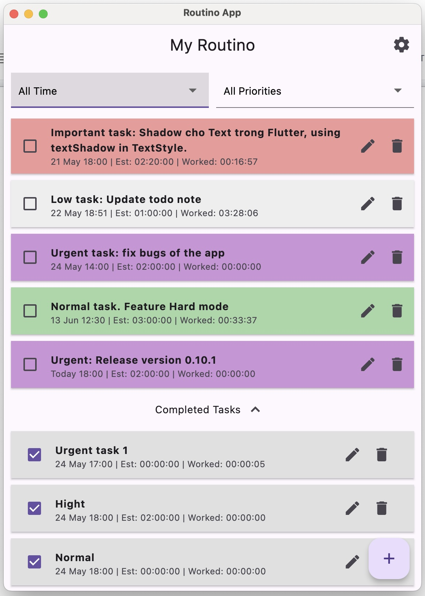
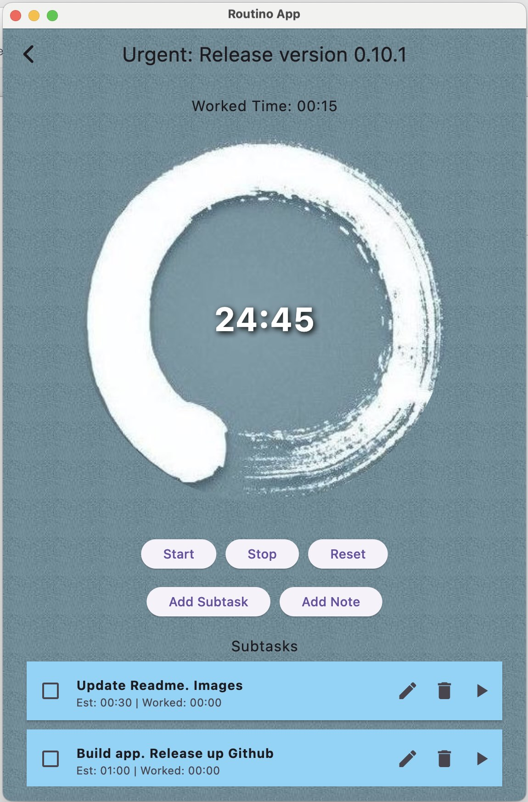
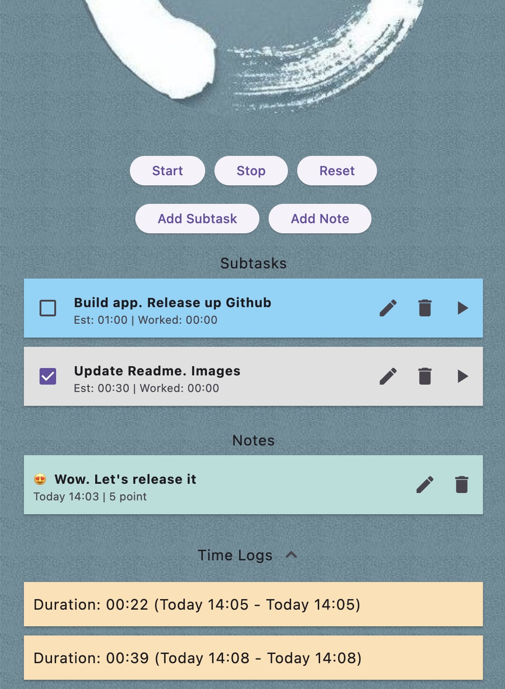

# Routino App
A application for tasks management with pomodoro method

## Download
https://github.com/kanbui/routino_app/blob/main/releases/macos/Routino-0.1.0.zip

## Screenshots

## Techstack
- Flutter: 3.25.0-1.0.pre.127
- Dart: Dart 3.6.0 (build 3.6.0-175.0.dev) • DevTools 2.39.0-dev.15
- SQLite database
